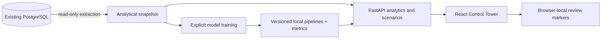

# Demo design and model methodology

## Source documents and scope

This branch follows the user’s explicit portfolio-demo brief. The documents are reference material, not instructions to implement every listed technology.

- **AI_ML_Logistics_Control_Tower_Study_Guide.pdf**: sections 2, 3, 7 and 10 informed the classical ML choices, KPI relationships, exception management, scenario analysis and model evaluation.
- **Intelligent_Control_Tower_Development_Roadmap.pdf**: the observe → detect → predict → explain → recommend cycle; phases 2–5 and 9; chronological validation; data provenance; and planner review informed the implementation.
- The explicit brief takes priority over the roadmap’s broader infrastructure recommendations. No Kafka, Airflow, Kubernetes, cloud platform, authentication system or autonomous operational execution was introduced.

## Architecture

The source tables and SQLAlchemy connection configuration are retained. Read-only extraction uses raw SQL against a fixed internal allowlist, avoiding incomplete ORM enum mappings. No arbitrary table name comes from an API request. Snapshot serialization converts UUIDs explicitly. A full extraction must succeed before replacing the previous snapshot.

The API loads pipelines once. UI rendering never triggers model fitting. Legacy exploration endpoints remain available and connect lazily; they require database access, unlike the cached tower endpoints. Model/schema changes require explicit retraining.

## Data reality

The inspected PostgreSQL data contains 12,000 completed shipments, 10,000 delivered sales orders, 1,200 received purchase orders, 2,500 completed production orders, 54 inventory balances, 30 products and 33 locations. Twenty-four products have independent sales demand.

The dataset’s inventory snapshot is later than its final sales week. The application does not change historical statuses to invent active disruptions. Historical shipment predictions are restricted to the test-period cohort. Supplier scores average test-period predictions. Inventory planning is a forward projection from the dated inventory balance, explicitly carrying forward the latest forecast level.

## Evaluation

### Shipment classification and delay regression

- Known-at-planning features: load, volume, distance, mode, service, carrier, route endpoints, planned transit duration, weekday and month.
- Outcome: actual arrival after planned arrival; regression target is positive delay hours. Actual arrival and recorded delay never enter the feature builder.
- Holdout: last 20% of planned-departure dates. Training records whose actual arrival is at/after the cutoff are purged because their outcomes were not yet observable.
- Metrics: accuracy, precision, recall, F1, ROC-AUC, Brier score and confusion matrix; MAE, RMSE and R² for delay duration.
- Random forest and logistic regression are compared on the same holdout. The serving forest is retained as an explicitly experimental demonstration, even where the linear baseline performs better. Low discrimination and recall are surfaced rather than hidden.
- The evaluated models serve unchanged; there is no undocumented full-data refit contaminating replay predictions.

### Freight

Retains the original experiment’s linear-regression direction with weight, volume, distance, carrier, mode and service. Numeric imputation/scaling and one-hot encoding are stored with the estimator. A random-forest comparison reports its own recalculated metrics. Scenario outputs clip impossible negative costs and warn on numeric extrapolation and unseen mode/service/carrier combinations. Holding planned route/timing fixed is a sensitivity experiment, not proof that switching carrier improves service.

### Demand

Order date × SKU ordered quantity is aggregated into Monday-start weeks. Cancelled orders are excluded, missing complete calendar weeks are zero-filled, and the newest partial week is excluded.

Candidate models are last week, four-week moving average and simple exponential smoothing (α=0.3). An inner four-week validation selects the method. The final eight complete weeks remain untouched until reporting a fixed-origin holdout. The selected method is then refit on complete history for the future four-week forecast.

Per-SKU metrics are MAE, RMSE, WAPE, bias and nonzero-demand MAPE. Overall WAPE pools absolute errors and actual quantities across SKU tests. Approximate 80% bands use 1.28 times recent residual standard deviation; they are descriptive uncertainty ranges and are not calibrated multi-step intervals.

### Supplier and anomaly models

Supplier classification uses order-placement attributes and requested delivery lead time. Revised confirmed delivery dates and final fulfillment quantities are excluded from features. Outcomes after the chronological cutoff are purged. The UI displays original-requested-date OTD separately from experimental late-delivery scores.

Isolation Forest fits the shipment training period and flags unusual held-out completed shipments using realized cost, load, distance and positive delay. This is post-outcome anomaly review, not a pre-departure predictor. Its 4% contamination is a sensitivity parameter; holdout flagged share is not an accuracy measure. Cost/km comparisons match mode and service, not route/load.

## Inventory and recommendation rules

- Daily demand = SKU weekly forecast × warehouse share of recent ordered demand ÷ 7.
- Start with available stock, already net of reservations.
- Each day: add receipts due that day, subtract expected demand. Negative balance represents projected backlog.
- Purchase receipts use confirmed quantity less received quantity, with a future confirmed date. Transfers use shipped less received quantity and the required future arrival date. Closed/cancelled orders and overdue receipts are excluded.
- Do not add the balance table’s in-transit field on top of dated orders: that would risk double counting.
- High risk means at least one day below zero. Medium means ending below safety stock. Low means neither. Unscored positions lack an independent demand forecast/location share.
- Days of supply = current available stock ÷ daily demand. Undefined if no demand; future replenishment does not retroactively change current coverage.
- Excess stock: current available exceeds 56 days of demand plus safety stock.
- A transfer candidate can use donor stock above its own 28-day demand and safety stock. Candidate quantities are not reserved across other recommendations. Stated coverage improvement assumes immediate receipt; arrival feasibility still needs review.
- The inventory scenario checks the entire trajectory, so a late replenishment cannot erase an earlier stockout. Safety stock alters a threshold, not physical inventory. Replenishment cost uses product unit cost and is not a landed quote.

## KPI definitions

| KPI | Calculation |
| --- | --- |
| Shipment OTD | Completed non-cancelled arrivals ≤ planned arrival / completed shipments; zero-hour tolerance |
| Delay rate | 1 − shipment OTD for the same cohort |
| Freight spend | Sum of recorded freight cost on completed non-cancelled shipments |
| Average transit | Mean actual arrival − actual departure, hours |
| Supplier OTD | Completed POs received by original requested date / completed POs |
| Supplier fill rate | Received units / ordered units |
| Supplier rejection | Rejected units / received units |
| Inventory value | On-hand units × product unit cost |
| Capacity utilization | Sum actual capacity units / sum planned capacity units |
| Plan attainment | Produced order quantity / planned order quantity |
| Scrap rate | Scrapped order quantity / produced order quantity |
| Forecast WAPE | Sum absolute errors / sum actual holdout demand |

OTIF, inventory turnover, physical inventory accuracy and causal savings are not fabricated. This demo does not establish all timestamps, denominator periods or operational controls necessary to calculate them responsibly.

## Future work

Improve explanatory delay/supplier data and probability calibration; add rolling-origin forecast evaluation and forecast-dependent component demand; implement constrained transfer allocation and lead-time-aware inbound uncertainty; introduce persistent planner feedback and shared audit history. Consider advanced forecasting or segmentation only when evaluation justifies it. Streaming, orchestration, cloud deployment, NLP assistants and full digital-twin simulation remain separate roadmap work.
